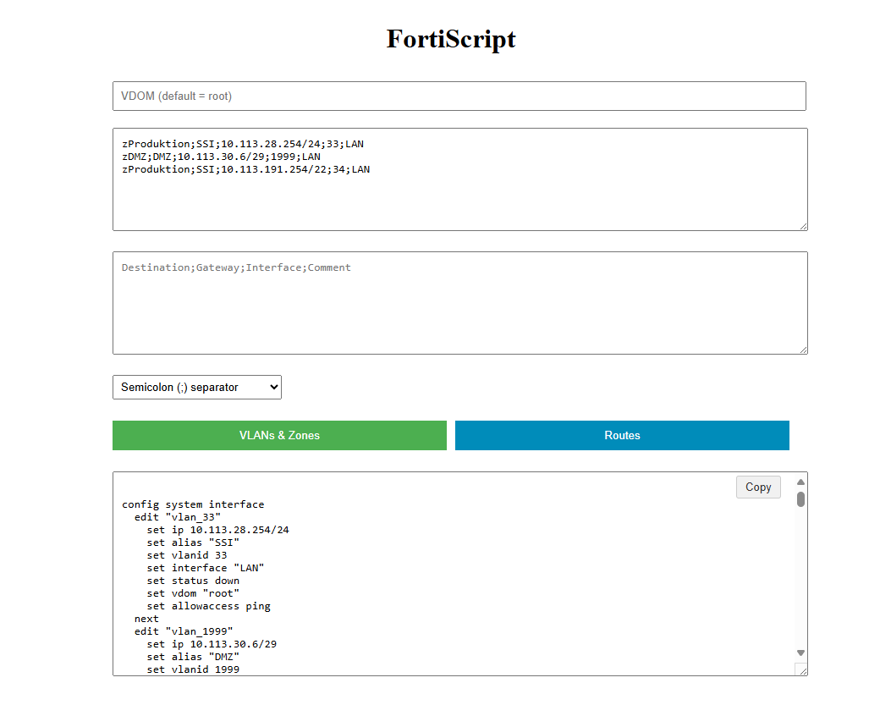

# CSV to FortiOS CLI Converter

[](https://opensource.org/licenses/MPL-2.0)
[](https://www.python.org/)
[](https://www.docker.com/)
[](https://flask.palletsprojects.com/)

A web application that converts CSV data into FortiOS CLI commands, simplifying bulk configuration for FortiGate devices.



## Features

### ✅ Implemented Features
- **CSV Data Conversion**: Copy/paste or upload CSV formatted data for conversion
- **Multiple Formats**: Supports multiple seperator formats including Excel Tabs
- **VLAN Automation**: Automatic VLAN creation from CSV input
- **Zone Automation**: Automatic Security Zone creation and assignment
- **Route Automation**: Static route generation based on CSV parameters
- **Address Automation**: Create Adress Objects based on CSV parameters

### 🚧 Upcoming Features
- **Firewall Policy Generator**: Bulk policy creation from CSV
- **Address Object Management**: Create/modify address objects
- **Service Object Support**: Define services and service groups
- **NAT Rule Generation**: Automatic NAT rule conversion

### 🔮 Future Considerations
- **API Integration**: Direct FortiGate REST API connectivity
- **Configuration Validation**: Pre-deployment syntax checking
- **Template Library**: Pre-built CSV templates for common scenarios
- **Version-Specific Output**: Target different FortiOS versions

## Installation

### Option 1: Docker (Recommended)
```bash
git clone https://github.com/TomTietz/fortiscript.git
cd fortiscript/flask-app
docker build -t fortiscript-app .
```

### Option 2: Python Installation
#### Prerequisites
- Python 3.11+
- pip

#### Installation Steps
```bash
git clone https://github.com/TomTietz/fortiscript.git
cd fortiscript/flask-app
pip install -r requirements.txt
python ./app.py
```

### Running the Application
For Docker:
```bash
docker run -d -p 5000:5000 --name fortiscript fortiscript-app
```

For Python:
```bash
python app.py
```

Access the application at http://localhost:5000


## License

This project is licensed under the Mozilla Public License 2.0 - see the [LICENSE](LICENSE) file for details.

## Contributing

Contributions are welcome under the terms of the MPL 2.0 license. Please fork the repository and submit a pull request.

## Security

For security issues, please disclose responsibly by emailing tomtietz@proton.me
